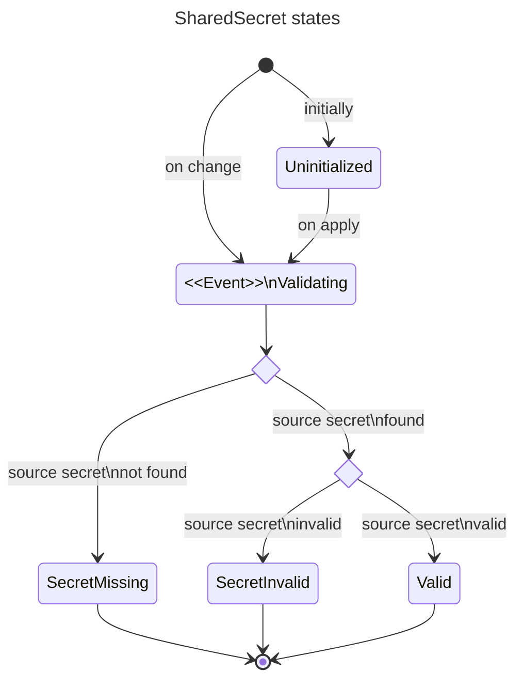
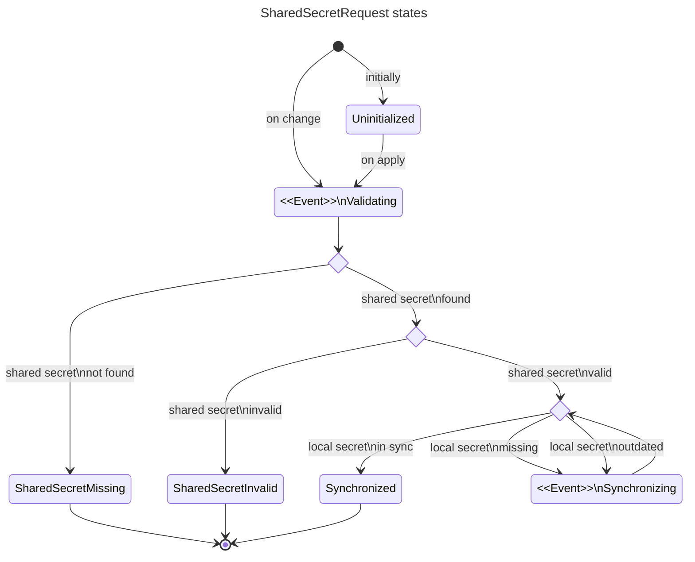

```mermaid
--- 
title: SharedSecret states
---

stateDiagram-v2
    Uninitialized: Uninitialized
    [*] --> Uninitialized: initially
    [*] --> Validating: on change
    state "&lt;&lt;Event&gt;&gt;\nValidating" as Validating
    Uninitialized --> Validating: on apply
    state check_secret <<choice>>
    Validating --> check_secret
    check_secret --> SecretMissing: source secret\nnot found
    SecretMissing --> [*]
    state check_secret_valid <<choice>>
    check_secret --> check_secret_valid: source secret\nfound
    check_secret_valid --> SecretInvalid: source secret\ninvalid
    SecretInvalid --> [*]
    check_secret_valid --> Valid: source secret\nvalid
    Valid --> [*]
```

# SharedSecretRequest

```mermaid
---
title: SharedSecretRequest states
---
stateDiagram-v2
    [*] --> Uninitialized: initially
    [*] --> Validating: on change
    state "&lt;&lt;Event&gt;&gt;\nValidating" as Validating
    Uninitialized --> Validating: on apply
    state check_shared_secret <<choice>>
    Validating --> check_shared_secret
    check_shared_secret --> SharedSecretMissing: shared secret\nnot found
    SharedSecretMissing --> [*]
    state check_shared_secret_valid <<choice>>
    check_shared_secret --> check_shared_secret_valid: shared secret\nfound
    check_shared_secret_valid --> SharedSecretInvalid: shared secret\ninvalid
    SharedSecretInvalid --> [*]
    state check_secrets_outdated <<choice>>
    check_shared_secret_valid --> check_secrets_outdated: shared secret\nvalid
    check_secrets_outdated --> Synchronized: local secret\nin sync
    Synchronized --> [*]
    state "&lt;&lt;Event&gt;&gt;\nSynchronizing" as Synchronizing
    check_secrets_outdated --> Synchronizing: local secret\nmissing
    check_secrets_outdated --> Synchronizing: local secret\noutdated
    Synchronizing --> check_secrets_outdated
```